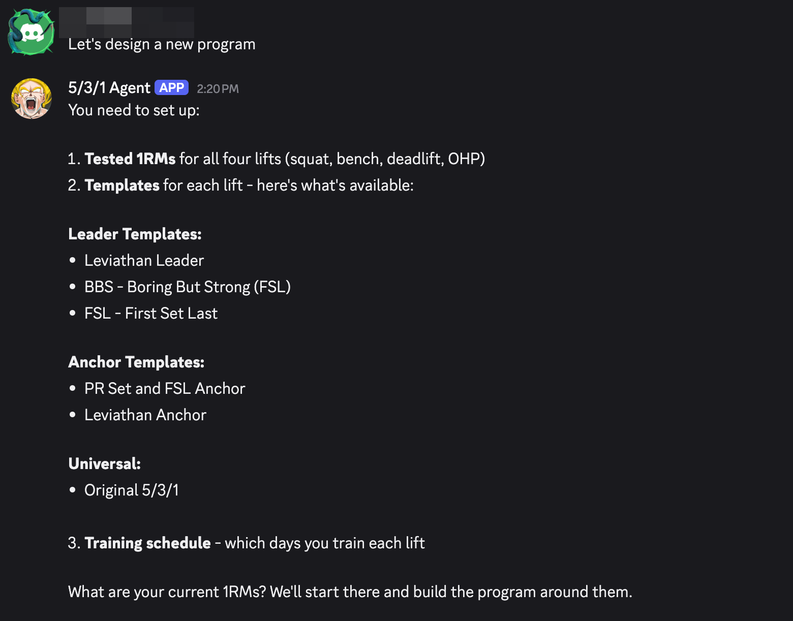
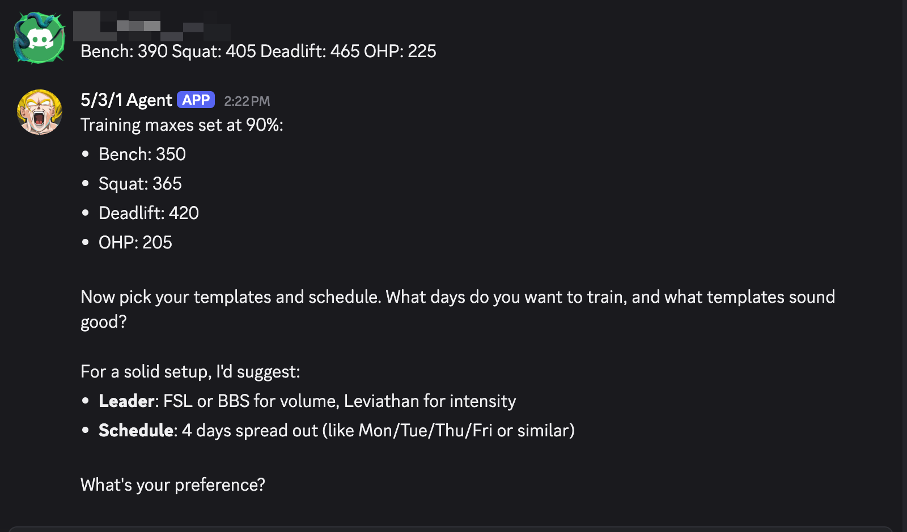
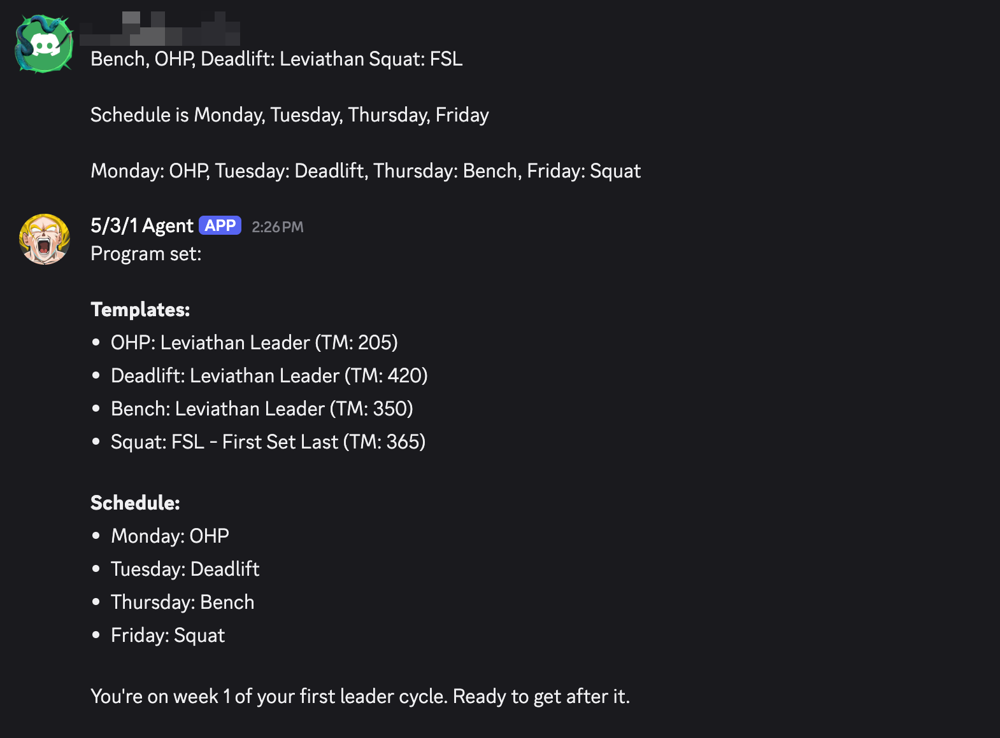
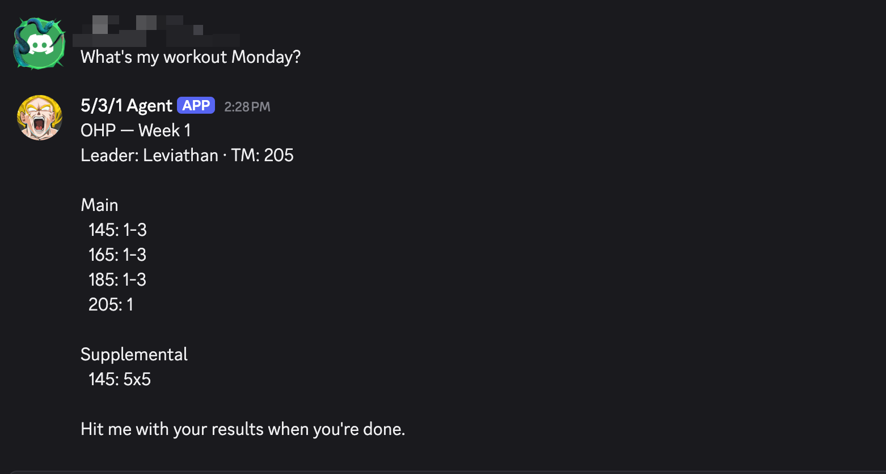
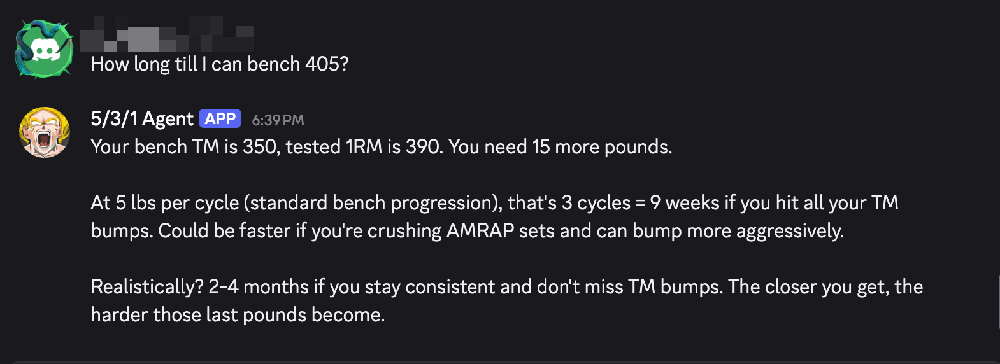

# agent-531

A 5/3/1 training agent on Discord.

## About

Personal Discord bot and Anthropic agent SDK that builds lifting programs from [Jim Wendler's 5/3/1 templates](https://www.jimwendler.com/products/5-3-1-forever-book).

This essentially uses SQLite and a bunch of tool calling.

Interactions with the bot are shown below. Built as an experiment to see if I could create an agent that could help me do something useful. So far, this seems ok, and I like being able to use natural language. Saying "My shoulder hurts, push this to tomorrow" or "Decrease the weight by 5% today" is nice. But, this whole thing could be an API. But! I am tired of building those. I do think this is overkill for the problem. I likely could build a bot with simliar functionality, use some NLP locally, and get similar results.

I also built similar functionality using a "Skill" that creates a full program and puts it in Notion or gives me clean ASCII I can print out. The downside of the skill is that it's a moment in time, no reminders, and training max values are set and can't be adjusted without re-using the same chat. The nice thing about a skill is I can design quick programs for other people. Something like "Design a bench press only program for someone with a 1 RM of 215".

### Potential Improvements

- If there's a workout scheduled for the day, the agent formats and presents it. But this doesn't really need an LLM. If the data is up to date, plain code can format a workout just fine. Saving some tokens.
- Doesn't handle templates that are longer than 3 weeks
- Handle SSL, Windowmaker, etc.
- User picks one program at a time. They can't plan out 2-3 leaders and an anchor.

## Interactions

### Program setup

The agent walks you through setting up a new program — tested 1RMs, template selection, and training schedule.







### Workout delivery

Ask for your workout and the agent pulls the prescribed sets from your current template, week, and training max.



### Asking questions

Ask the agent anything about your training and it responds with context from your program state.



## Deploy

### 1. Install dependencies

```bash
bun install
```

### 2. Configure environment

Create a `.env` file in the project root with your Discord bot token, Anthropic API key (optional), and allowed user ID.

### 3. Set up systemd user service

Create the service file:

```bash
mkdir -p ~/.config/systemd/user/
```

The service file `531-agent.service`:

```ini
[Unit]
Description=5/3/1 Training Agent
After=network.target

[Service]
Type=simple
WorkingDirectory=/home/tom/source/agent-531
ExecStart=/home/tom/.bun/bin/bun run src/index.ts
Restart=on-failure
RestartSec=10
EnvironmentFile=/home/tom/source/agent-531/.env

[Install]
WantedBy=default.target
```

### 4. Enable and start

```bash
systemctl --user daemon-reload
systemctl --user enable 531-agent.service
systemctl --user start 531-agent.service
```

Allow the service to run after logout:

```bash
loginctl enable-linger $USER
```

### 5. Useful commands

```bash
systemctl --user status 531-agent.service   # check status
journalctl --user -u 531-agent.service -f   # tail logs
systemctl --user restart 531-agent.service   # restart after code changes
```
